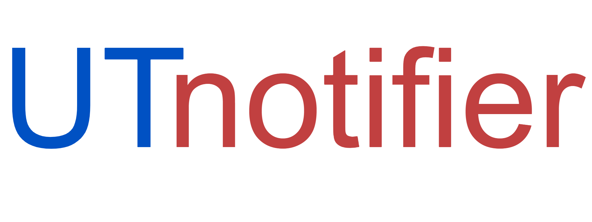

# How to run
1. Install dependencies with `pip install -r requirements.txt`
2. Run script with `python UTnotifier.py` (optional arguments available below)

# Arguments (use -h to see usage)
`--disable_headless` - disables headless mode

`--disable_saving` - disables saving of login details (currently not implemented)

`--disable_notifications` - disables showing notification when new test is available

`--disable_mqtt` - disables publishing the test count to MQTT server

`--debug` - shows additional information like page refresh

# ToDo:
- [x] ~~write better README~~ done?
- [x] ~~check if one ***more*** or one ***less*** test is available~~
- [x] ~~make ***disable saving credentials*** option~~
- [x] ~~make better logo (fix offset)~~
- [x] ~~make option for disabling headless mode (argument option?)~~
- [x] ~~add option to send notifications with MQTT (as sender.py ?)~~
- [x] ~~automatically detect chrome version and download proper webdriver~~
- [ ] make sure MQTT message are received
- [ ] make script detect a difference between "1" and "10" in website title (now only looks at first digit)
- [ ] add project icon
- [ ] properly kill webdriver
