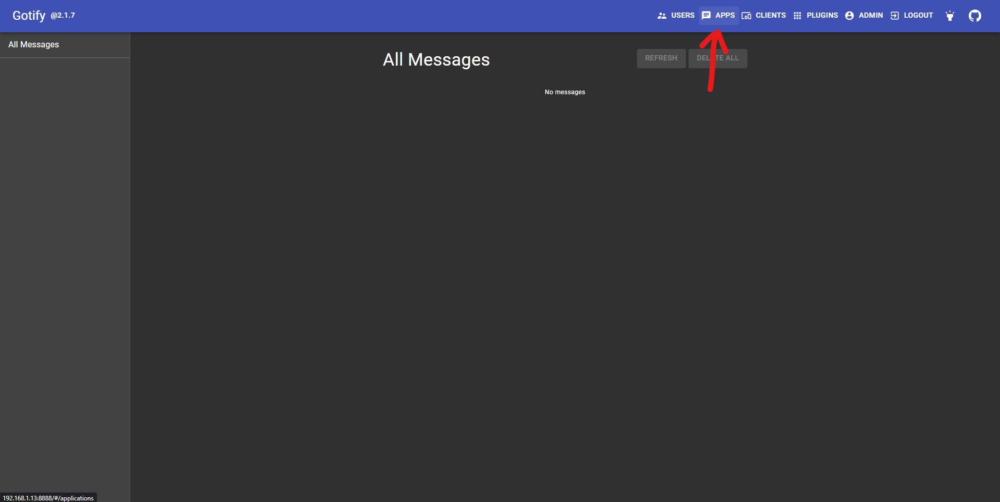
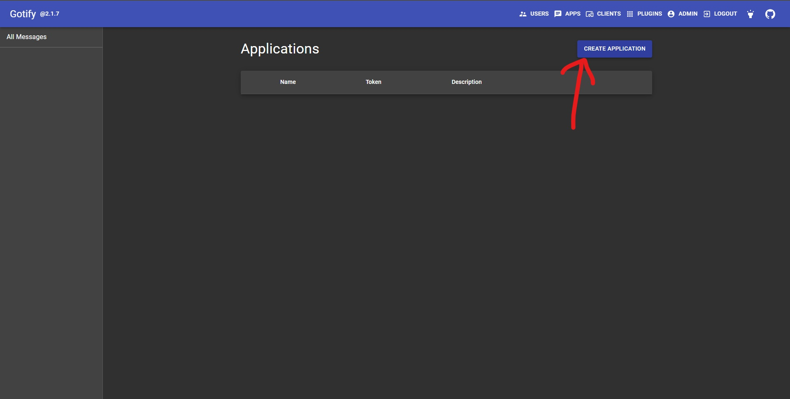
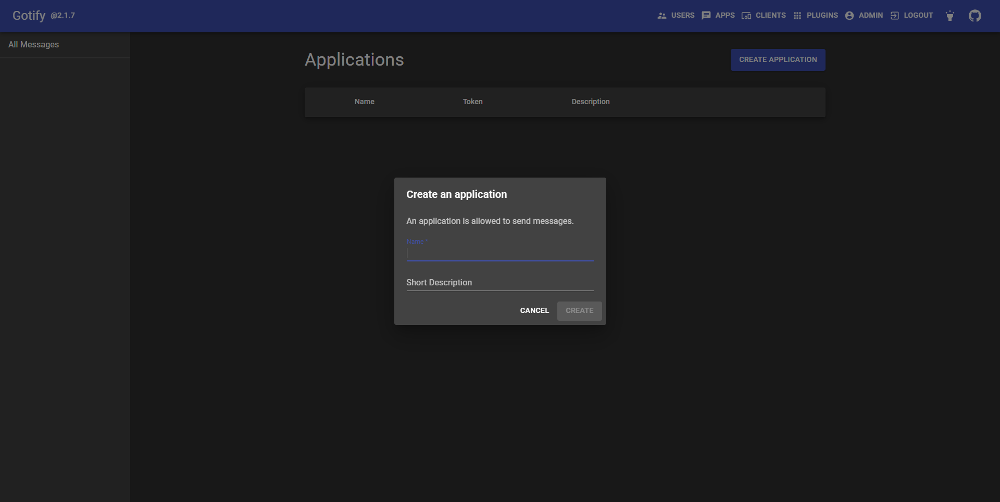
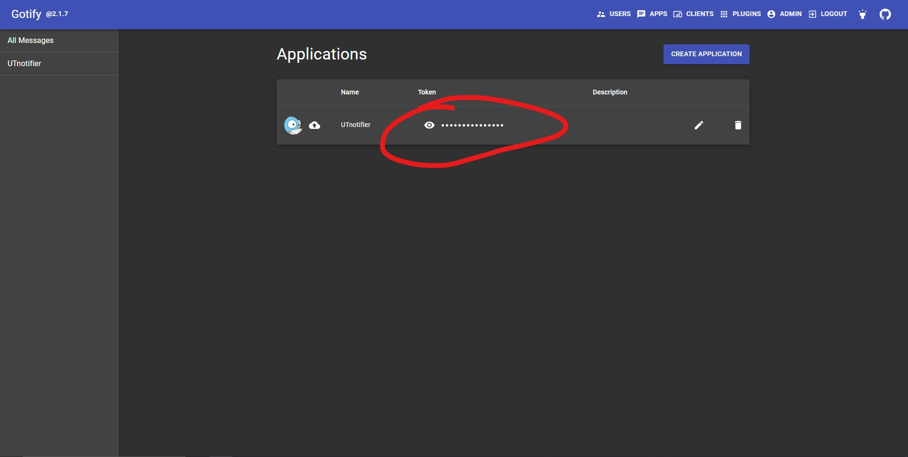

# Local (PC)
todo

# Home Assistant
todo

# Gotify
## Prerequisites:
- working instance of gotify

## Setup:
1. Click `Apps`

2. Click `Create application`

3. Add application name (optionally description)

4. Get the `TOKEN`

5. ??????, still not supported (hardcoded for now)